[English](./README.md) | 简体中文 

<h1 align="center">Spug</h1>

Spug是面向中小型企业设计的轻量级无Agent的自动化运维平台，整合了主机管理、主机批量执行、主机在线终端、文件管理、应用发布部署、流水线、在线任务计划、配置中心、监控、报警等一系列功能。

## 演示环境

演示地址：https://demo.spug.cc

演示环境运行最新版本，数据每小时自动重置，可在页面右上角切换简体中文 / 英文界面。

## 🔥推送助手

推送助手是一个集成了电话、短信、邮件、飞书、钉钉、微信、企业微信等多通道的消息推送平台，可以3分钟实现Zabbix、Prometheus、夜莺等监控系统的电话短信报警，点击体验：[https://push.spug.cc](https://push.spug.cc)

## 特性

- **主机管理**: 支持分组管理、从云厂商或 Excel 批量导入、批量连通性验证
- **批量执行**: 支持主机命令在线批量执行，支持参数化命令、执行模板与执行历史
- **在线终端**: 主机支持浏览器在线终端登录
- **文件管理**: 支持主机文件在线上传下载
- **文件分发**: 支持将文件、目录从一台主机分发到多台主机
- **构建部署**: 支持应用自定义构建部署，支持发布审核、灰度发布与回滚
- **流水线**: 支持将参数化、构建、执行命令、数据传输、数据上传、钉钉/飞书/企业微信/推送助手通知等节点编排为流程，支持条件分支与实时控制台
- **任务计划**: 支持在线配置Crontab、间隔等任务计划
- **配置中心**: 支持KV、文本、json等格式的在线配置
- **监控中心**: 支持站点、端口、进程、Ping、自定义脚本等监控
- **报警中心**: 支持邮件、微信、钉钉、企业微信、飞书等报警方式
- **凭据管理**: 集中管理密码与密钥，供主机复用
- **权限控制**: 细粒度的角色权限控制，支持 LDAP 登录与 MFA 认证
- **中英双语**: 界面支持简体中文和英文，可在页面右上角切换
- **优雅美观**: 基于 Ant Design 的UI界面
- **开源免费**: 前后端代码完全开源

## 环境

* Python 3.8+
* Django 4.2
* Node.js 18+
* React 16.13
* Redis 5.0+

## 安装文档

- 官网地址：https://ops.spug.cc/docs/install-docker/
- 使用文档：https://ops.spug.cc/docs/about-spug/
- 更新日志：https://ops.spug.cc/docs/change-log/
- 常见问题：https://ops.spug.cc/docs/faq/
- 推送助手：https://push.spug.cc

## 推荐项目
[Yearning — MYSQL 开源SQL语句审核平台](https://github.com/cookieY/Yearning)

## 预览

### 工作台
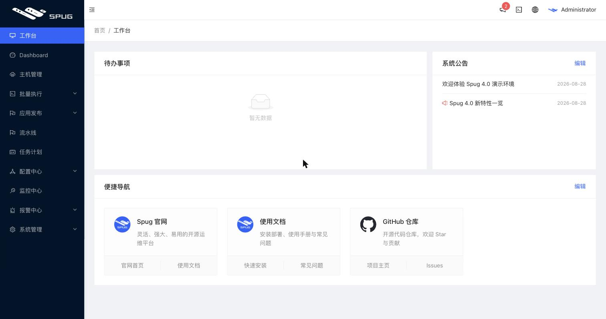

### 数据统计
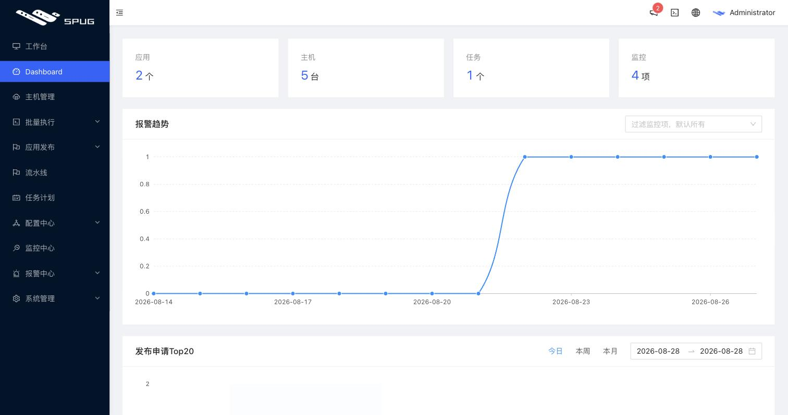

### 主机管理
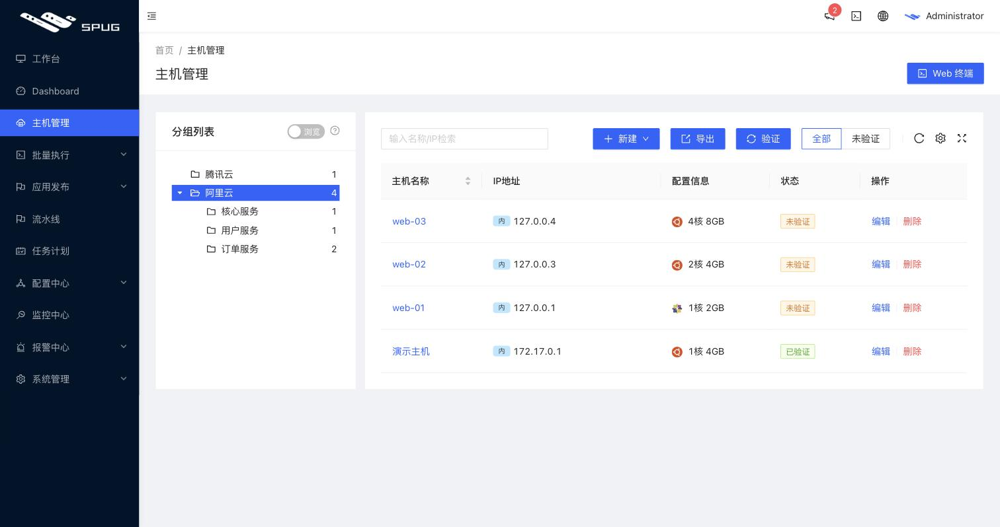

#### 主机在线终端
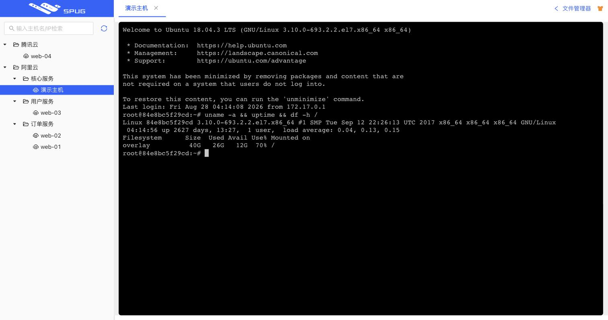

#### 文件在线上传下载
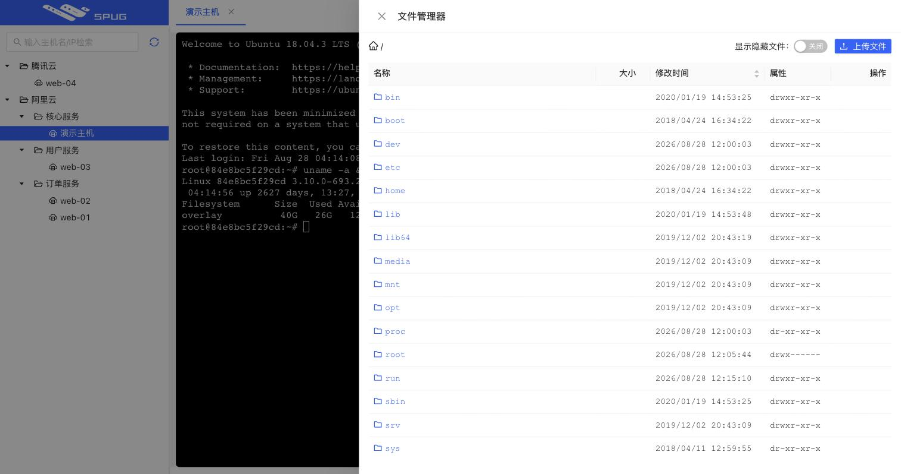

#### 主机批量执行
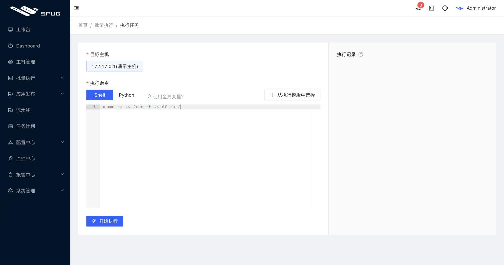
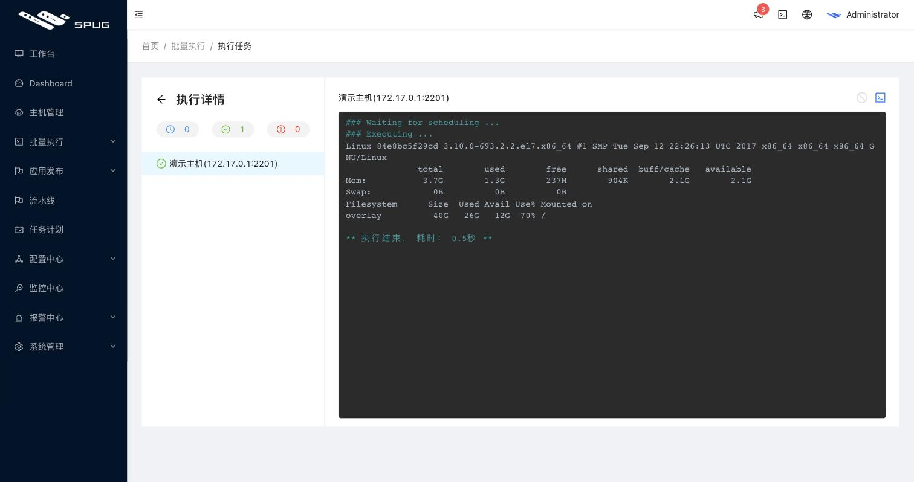

### 流水线
支持将构建、执行命令、数据传输、数据上传与消息推送等节点自由编排为流程。

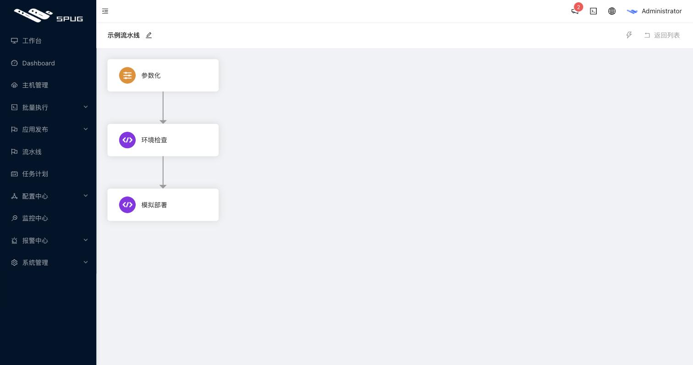
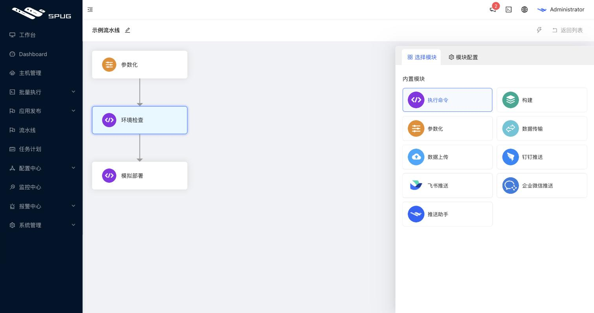
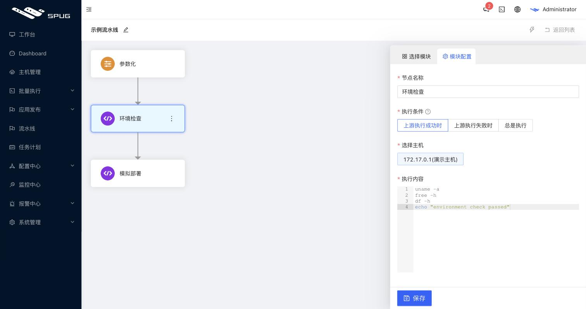
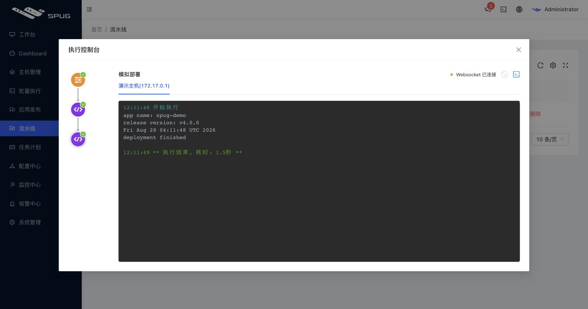

### 应用发布
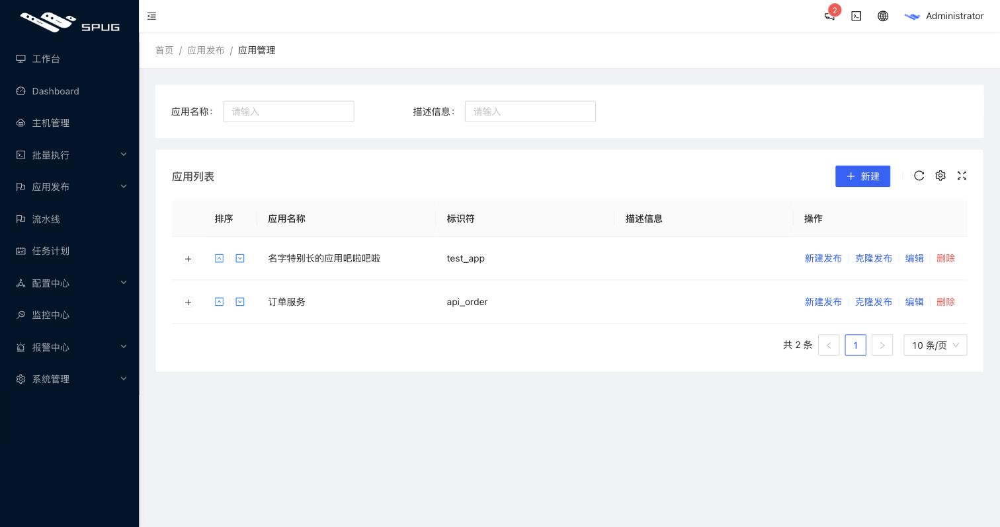
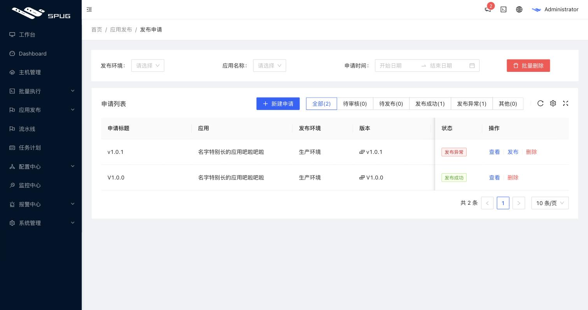
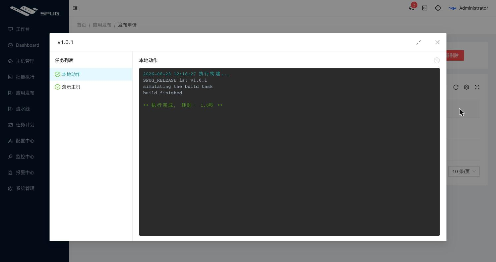

### 任务计划
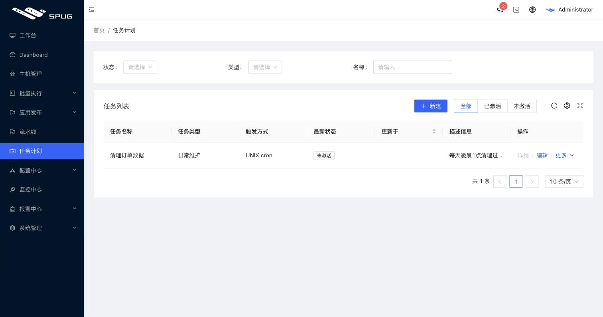

### 配置中心
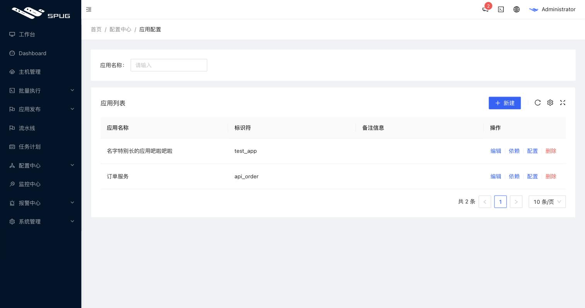

### 监控报警
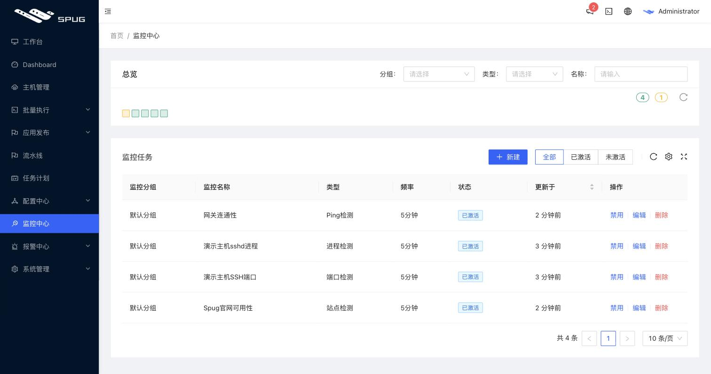
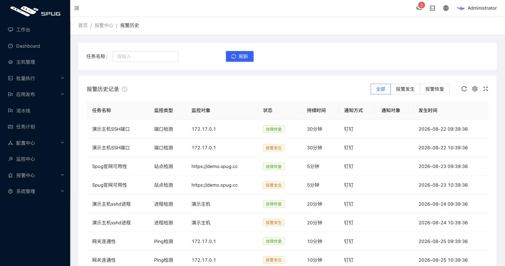

## 赞助
<table>
  <thead>
    <tr>
      <th align="center" style="width: 115px;">
        <a href="https://www.ucloud.cn/site/active/kuaijie.html?invitation_code=C1xD0E5678FBA77">
           
          UCloud 
          5 元/月云主机
        </a>
      </th>
        <th align="center" style="width: 115px;">
        <a href="https://www.aliyun.com/minisite/goods?userCode=8vdj3myc">
           
          阿里云通用券 
          300元限量免费领
        </a>
      </th>
      <th align="center" style="width: 125px;">
        <a href="http://www.magedu.com">
           
          马哥教育 
          IT人高薪职业学院
        </a>
      </th>
    </tr>
  </thead>
</table>

## 开发者群
#### 关注Spug运维公众号加微信群、QQ群、获取最新产品动态

   

  
## License & Copyright
[AGPL-3.0](https://opensource.org/licenses/AGPL-3.0)
