English | [简体中文](./README-zh_CN.md) 

<h1 align="center">Spug</h1>

Spug is a lightweight agent-free automatic operation and maintenance platform designed for small and medium-sized enterprises. It integrates host management, host batch execution, host online terminal, file management, application release and deployment, pipelines, online task planning, configuration center, monitoring, alarm and so on.

## Demo

Demo：https://demo.spug.cc

The demo environment runs the latest version and resets its data every hour, both the English and the Simplified Chinese interface are available from the globe icon in the header.

## 🔥Push Assistant 

Push Assistant is a message push platform that integrates multiple channels such as telephone, SMS, email, Feishu, DingTalk, WeChat, and WeChat Work. It can realize telephone and SMS alarms of Zabbix, Prometheus, Nightingale and other monitoring systems in 3 minutes. Click to experience: [https://push.spug.cc](https://push.spug.cc)

## Features

- **Host Management**: Manage hosts by group, import them from cloud providers or an Excel file, and check connectivity in batch
- **Host Batch Execution**: Support host batch online command execution, with parameterized commands, reusable templates and execution history
- **Host Online Terminal**: The host supports browser online terminal login
- **Host File Management**: Support host files online upload and download
- **File Distribution**: Distribute files and directories from one host to many hosts
- **Build and Deploy**: Support application custom build deployment, with review flow, canary release and rollback
- **Pipelines**: Orchestrate parameter, build, remote command, data transfer, data upload and DingTalk / Feishu / WeChat Work / Push Assistant notification nodes into a workflow, with conditional branches and a live console
- **Task Planning**: It supports online configuration of crontab, interval and other task schedules
- **Configuration Center**: Support KV, text, json and other formats online configuration
- **Monitoring Center**: Support site, port, process, ping, custom script and other monitoring
- **Alarm Center**: Support email, WeChat, DingTalk, WeChat Work, Feishu and other alarm methods
- **Credential Management**: Keep passwords and private keys in one place and share them across hosts
- **Permission Control**: Fine-grained role and permission control, LDAP login and MFA are supported
- **Bilingual UI**: Full English and Simplified Chinese interface, switchable from the header
- **Elegant and beautiful**: UI interface based on Ant Design
- **Open source and free**: The front-end and back-end code is completely open source

## Environment

* Python 3.8+
* Django 4.2
* Node.js 18+
* React 16.13
* Redis 5.0+

## Install Doc

- Home Page：https://ops.spug.cc/docs/install-docker/
- Useage Doc：https://ops.spug.cc/docs/about-spug/
- Change Log：https://ops.spug.cc/docs/change-log/
- FAQ：https://ops.spug.cc/docs/faq/
- Spug Push：https://push.spug.cc

## Recommended 
[Yearning — MYSQL open source SQL statement review platform](https://github.com/cookieY/Yearning)

## PreView

### Workbench
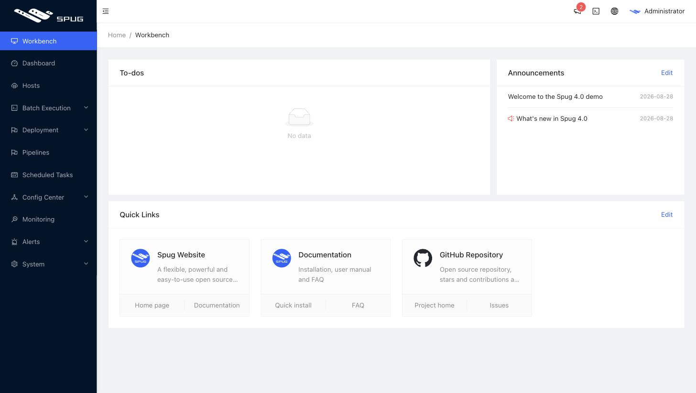

### Dashboard
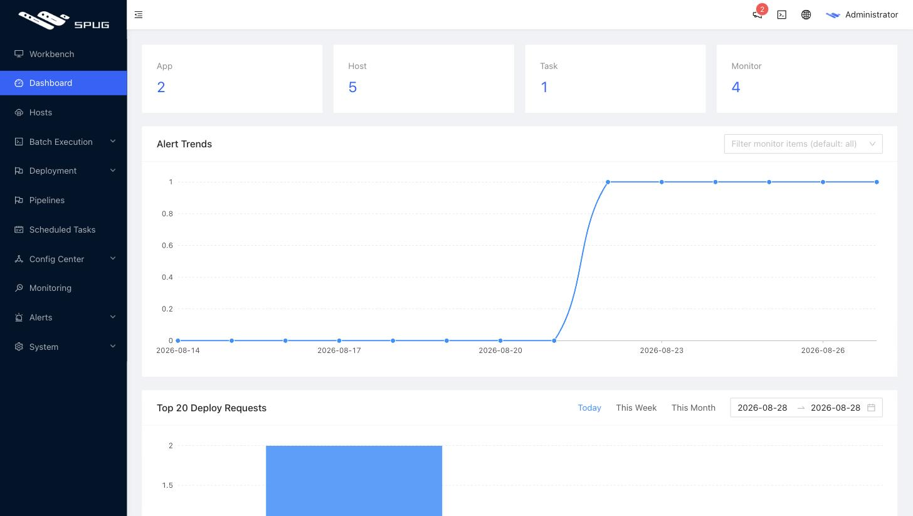

### Host Management
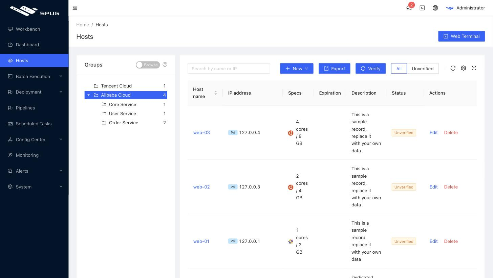

#### Host Online Terminal
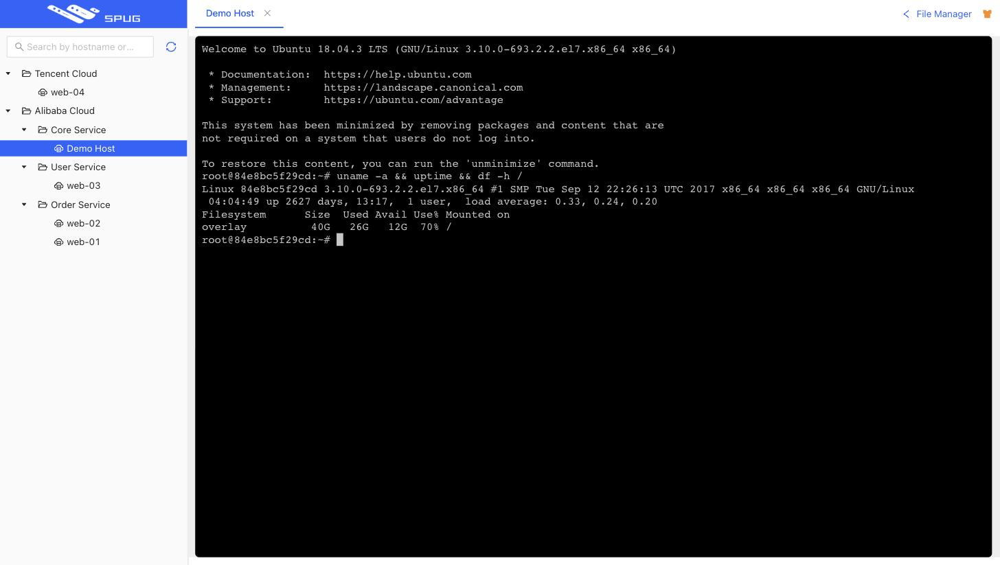

#### File Online Upload and Download
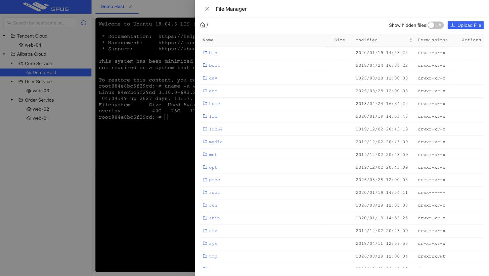

#### Host Batch Execution
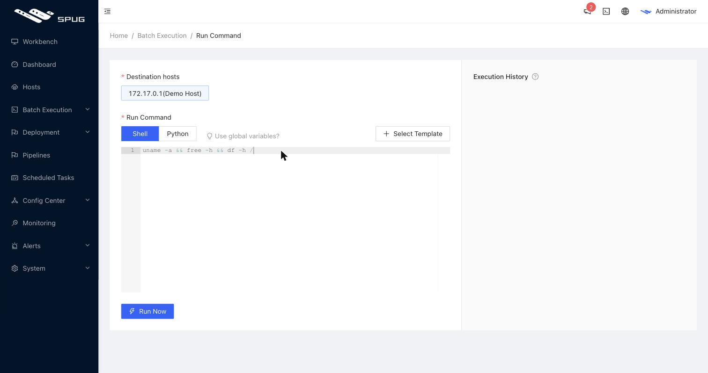
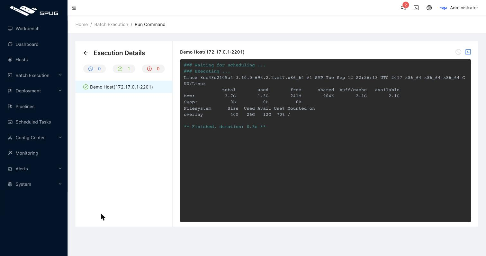

### Pipelines
Orchestrate build, command, data transfer, upload and notification nodes into a workflow.

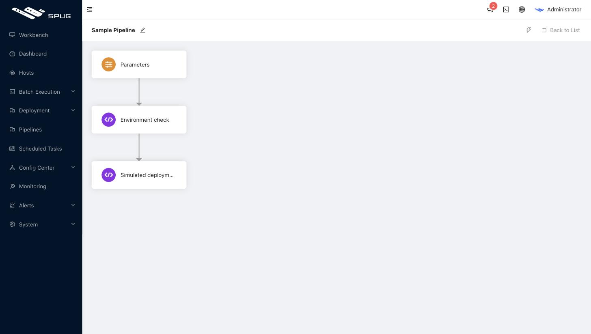
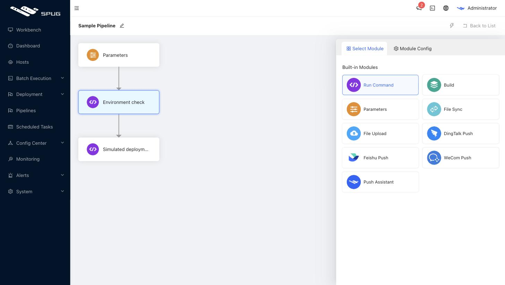
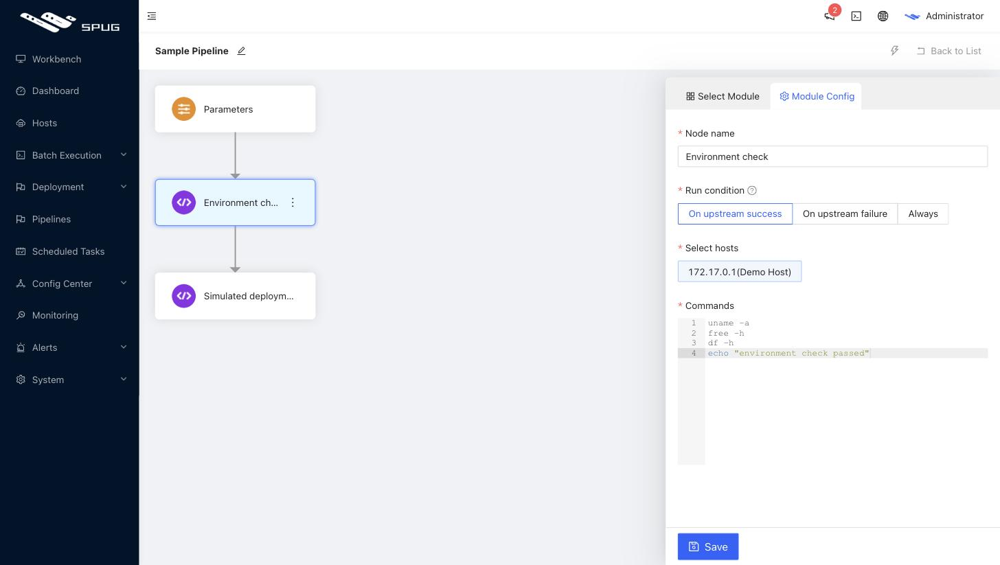
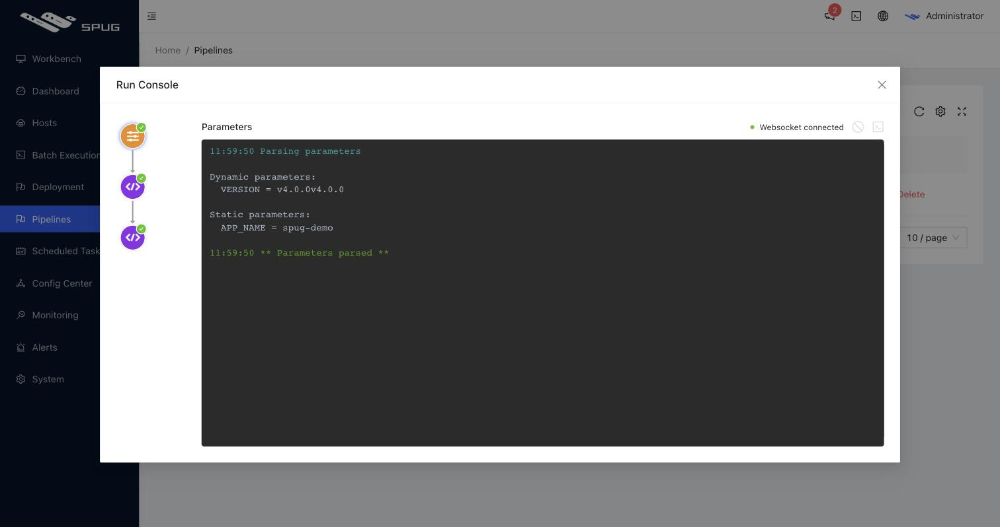

### Application Release
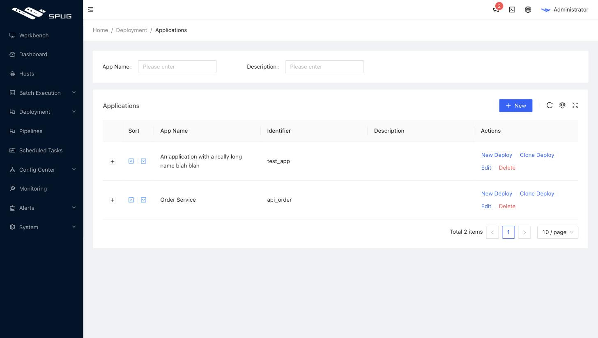
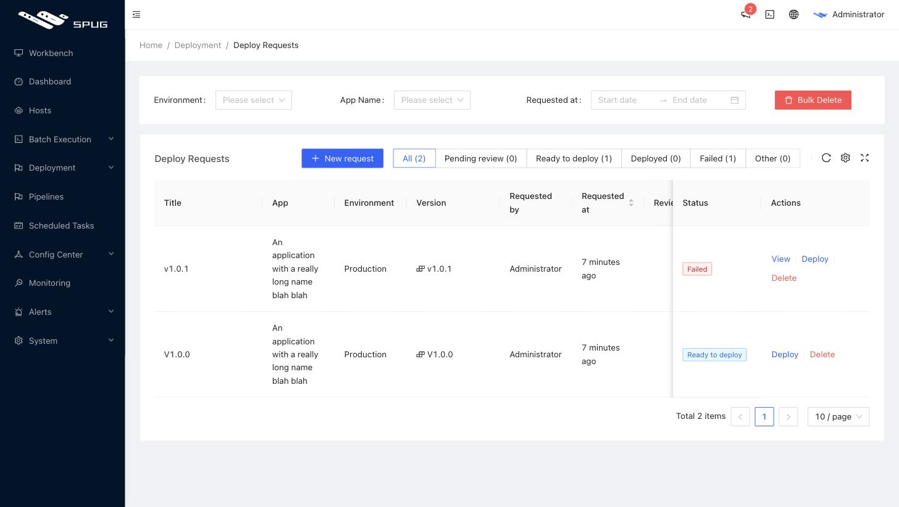
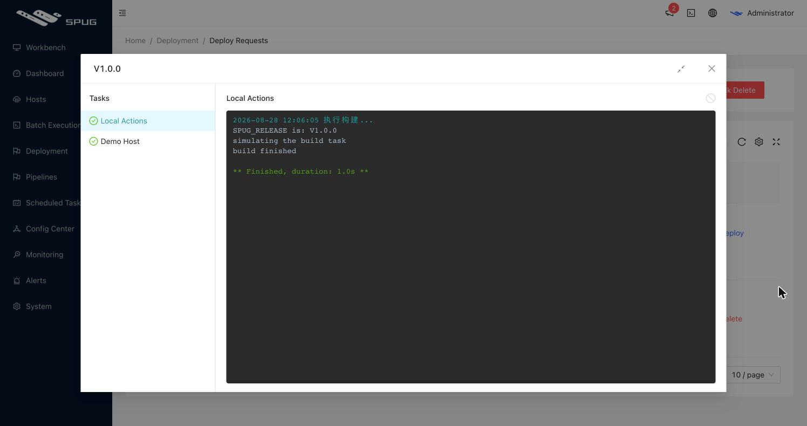

### Task Planning
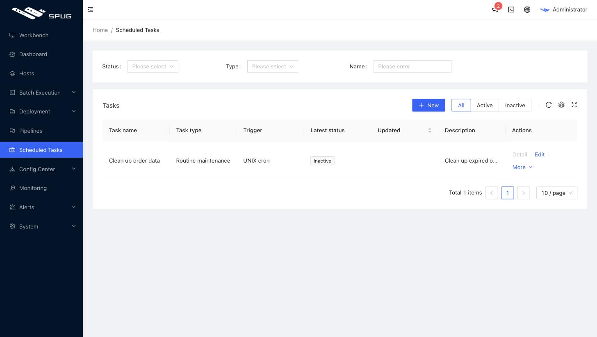

### Configuration Center
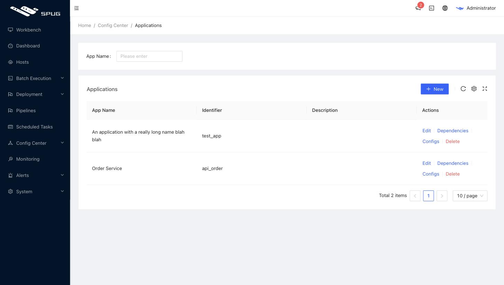

### Monitoring and Alarm
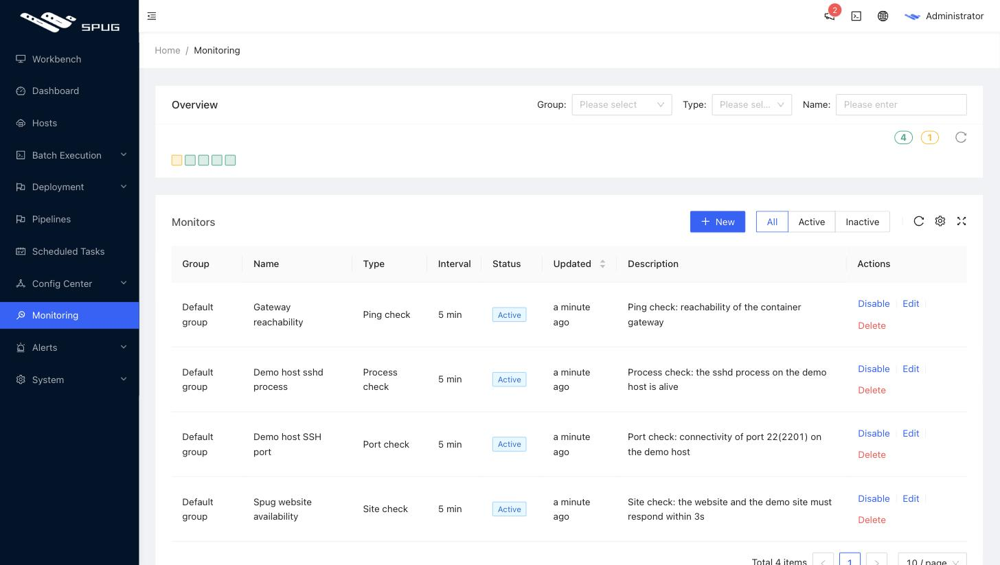
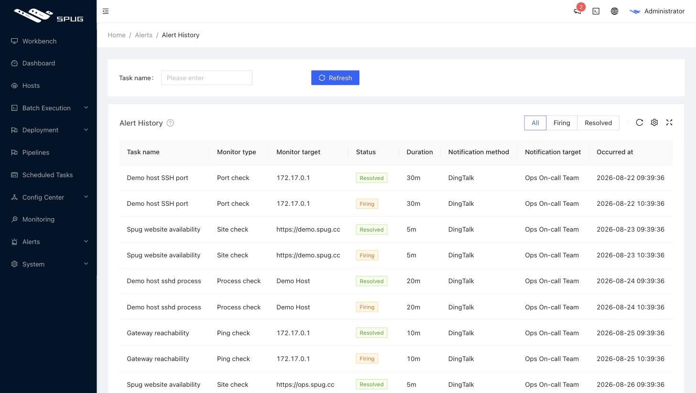

## Sponsor
<table>
  <thead>
    <tr>
      <th align="center" style="width: 115px;">
        <a href="https://www.ucloud.cn/site/active/kuaijie.html?invitation_code=C1xD0E5678FBA77">
           
          UCloud 
          5 元/月云主机
        </a>
      </th>
        <th align="center" style="width: 115px;">
        <a href="https://www.aliyun.com/minisite/goods?userCode=8vdj3myc">
           
          阿里云通用券 
          300元限量免费领
        </a>
      </th>
      <th align="center" style="width: 125px;">
        <a href="http://www.magedu.com">
           
          马哥教育 
          IT人高薪职业学院
        </a>
      </th>
    </tr>
  </thead>
</table>

## Developer Group
#### Follow the Spug operation and maintenance public number to add WeChat group, QQ group, and get the latest product dynamics

   

 
 
## License & Copyright
[AGPL-3.0](https://opensource.org/licenses/AGPL-3.0)
